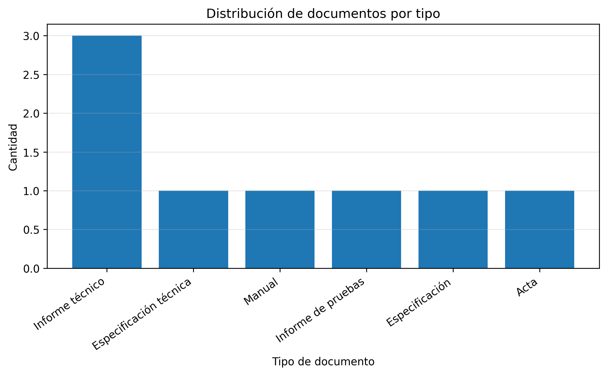
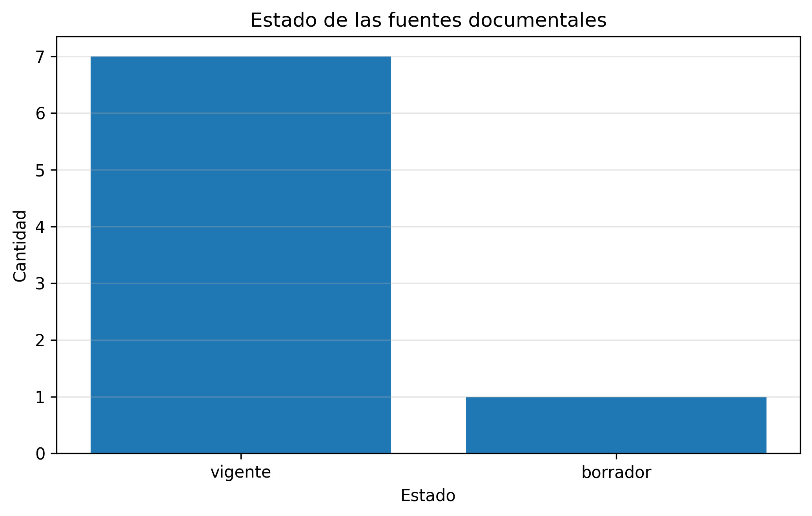
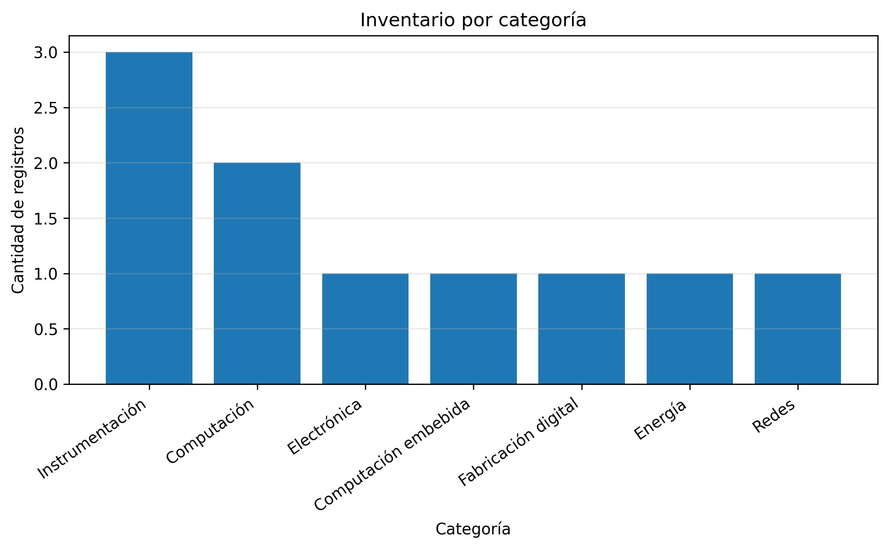
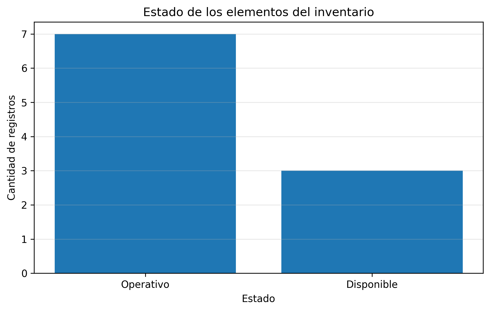
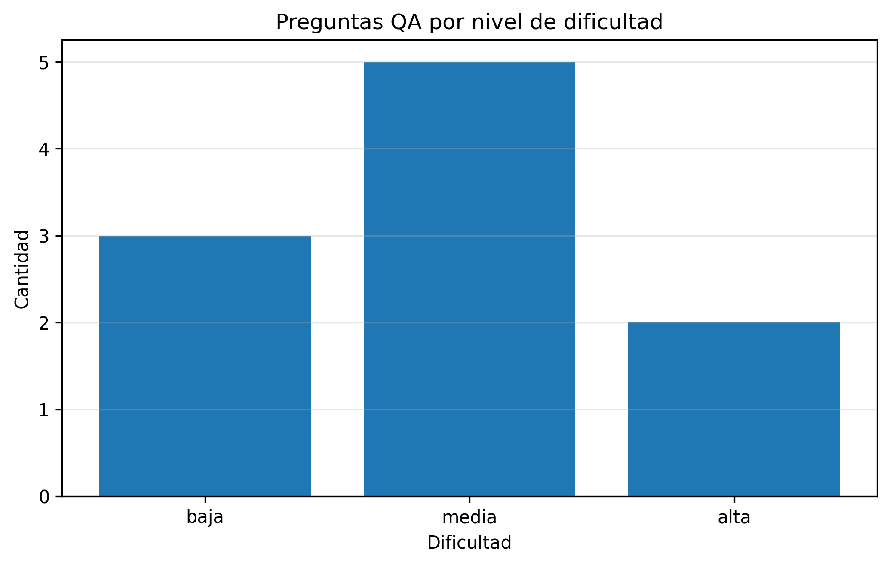
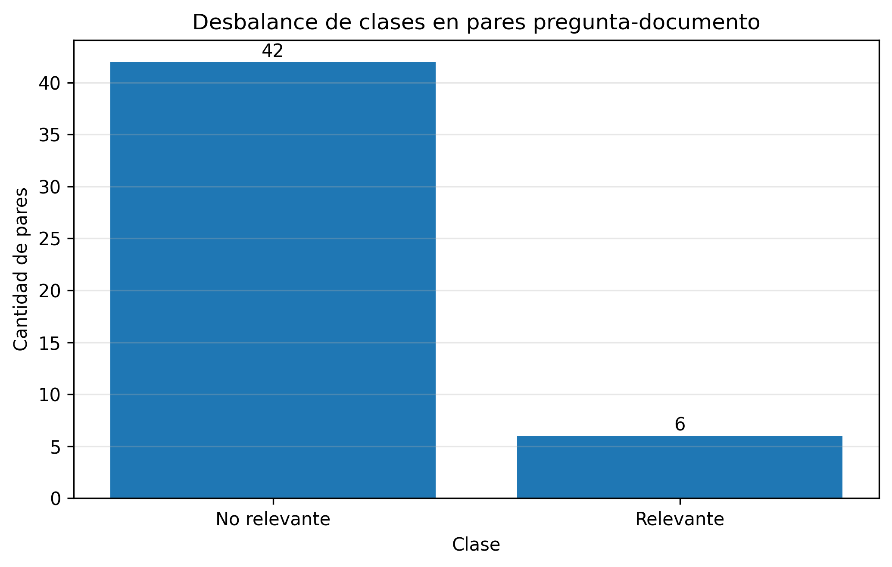

# Análisis exploratorio de datos

## 1. Propósito

Este documento describe el análisis exploratorio de los datasets sample utilizados en el proyecto **Asistente de IA para Innovación, Desarrollo y Gestión del Conocimiento Técnico — DINDES**.

Los datasets son **sintéticos y académicos**. Se emplean para validar la metodología, la estructura del pipeline y las métricas del prototipo sin publicar documentación institucional sensible.

---

## 2. Datasets disponibles

### 2.1 Dataset 1 — Documentación técnica

Archivo:

```text
data/Dataset_1_Documentacion_Tecnica_DINDES_Sample.csv
```

Dimensiones:

- **8 registros**
- **12 variables**

Variables:

| Variable | Descripción |
|---|---|
| `document_id` | Identificador único del documento |
| `project_id` | Identificador del proyecto relacionado |
| `document_type` | Tipo de documento |
| `title` | Título |
| `responsible_unit` | Unidad responsable |
| `document_date` | Fecha documental |
| `version` | Versión |
| `section` | Sección analizada |
| `chunk_id` | Identificador del fragmento |
| `text` | Texto utilizado por el sistema |
| `source_status` | Estado de la fuente |
| `access_level` | Nivel de acceso |

Hallazgos iniciales:

- Los 8 registros poseen `document_id` y `project_id` únicos.
- Existen **6 tipos de documento**.
- La unidad responsable es DINDES en todos los registros del sample.
- Todos los registros poseen nivel de acceso `autorizado`.
- Estado de fuentes: **7 vigentes** y **1 borrador**.
- No existen valores faltantes en este dataset.



**Figura 1. Distribución de documentos por tipo.**



**Figura 2. Estado de las fuentes documentales.**

---

### 2.2 Dataset 2 — Inventario institucional sample

Archivo:

```text
data/Dataset_2_Inventario_Institucional_DINDES_Sample.csv
```

Dimensiones:

- **10 registros**
- **11 variables**

Variables principales:

- `codigo`
- `descripcion`
- `categoria`
- `marca`
- `modelo`
- `cantidad`
- `unidad`
- `estado`
- `ubicacion`
- `responsable`
- `fecha_actualizacion`

Hallazgos iniciales:

- Los 10 códigos son únicos.
- Se identifican **7 categorías**.
- Las categorías con mayor presencia son Instrumentación (3) y Computación (2).
- Estados registrados: **7 Operativo** y **3 Disponible**.
- Todos los registros tienen responsable DINDES.
- No existen valores faltantes.



**Figura 3. Distribución del inventario por categoría.**



**Figura 4. Estado de los elementos del inventario.**

---

### 2.3 Dataset 3 — Evaluación QA

Archivo:

```text
data/Dataset_3_Evaluacion_QA_Asistente_IA_Sample.csv
```

Dimensiones:

- **10 registros**
- **9 variables**

Variables:

| Variable | Uso |
|---|---|
| `qa_id` | Identificador único |
| `question` | Pregunta de evaluación |
| `category` | Categoría |
| `expected_source_id` | Fuente esperada |
| `expected_answer` | Respuesta esperada |
| `acceptable_answer` | Criterio de aceptación |
| `difficulty` | Dificultad |
| `answerable` | Si existe evidencia suficiente |
| `notes` | Observaciones |

Distribución de dificultad:

- Baja: **3**
- Media: **5**
- Alta: **2**

Respondibilidad:

- `si`: **9**
- `no`: **1**

Existe **1 valor faltante** en `expected_source_id`, correspondiente al caso diseñado para evaluar el comportamiento del sistema ante información no disponible. Por tanto, no se considera un error de calidad de datos.



**Figura 5. Distribución de preguntas QA por dificultad.**

---

## 3. Análisis del problema auxiliar de relevancia

Para la actividad de diagnóstico de overfitting/underfitting se construyó un problema auxiliar de clasificación binaria **pregunta-documento**.

Se utilizaron las preguntas respondibles cuya fuente esperada pertenece al corpus documental (`DOC-*`).

Resultados:

- Preguntas utilizadas: **6**
- Documentos candidatos por pregunta: **8**
- Pares totales: **48**
- No relevantes: **42 (87.5 %)**
- Relevantes: **6 (12.5 %)**



**Figura 6. Desbalance de clases en los pares pregunta-documento.**

Este desbalance explica por qué **Accuracy no debe utilizarse de forma aislada**. En la evaluación de la clase relevante se utilizan principalmente Precision, Recall y F1.

---

## 4. Calidad de datos

### 4.1 Valores faltantes

| Dataset | Valores faltantes |
|---|---:|
| Documentación técnica | 0 |
| Inventario | 0 |
| QA | 1 |

El único dato faltante del dataset QA es intencional y representa una consulta sin fuente disponible.

### 4.2 Duplicados

Los identificadores principales (`document_id`, `codigo`, `qa_id`) son únicos en los samples actuales.

### 4.3 Consistencia

Los datasets mantienen identificadores diferenciados:

```text
DOC-*  → documentos
INV-*  → inventario
QA-*   → preguntas de evaluación
```

Esto facilita la trazabilidad entre pregunta, evidencia y respuesta esperada.

---

## 5. Patrones relevantes

Los principales patrones observados son:

1. **Corpus documental pequeño:** el sample contiene solo 8 registros, suficiente para demostrar el pipeline pero no para estimar desempeño operacional.
2. **Inventario heterogéneo:** incluye computación, instrumentación, electrónica, fabricación digital, energía y redes.
3. **QA variado:** contiene consultas documentales, de inventario, integración y una pregunta deliberadamente no respondible.
4. **Fuerte desbalance en relevancia:** la mayoría de los pares pregunta-documento son negativos.
5. **Escasez de positivos:** el número reducido de pares relevantes incrementa la variabilidad de Precision, Recall y F1.

---

## 6. Correlaciones y outliers

Los datasets actuales son principalmente categóricos y textuales, por lo que una matriz clásica de correlación numérica no aporta información significativa en esta etapa.

No se identifican outliers cuantitativos relevantes en los samples. El principal comportamiento extremo está asociado al **desbalance de clases** del problema auxiliar de relevancia.

En futuras versiones con mayor volumen se analizarán:

- longitud de documentos y chunks;
- distribución de similitudes semánticas;
- scores BM25;
- scores de reranking;
- tiempos de respuesta;
- número de fuentes recuperadas;
- métricas de relevancia por categoría.

---

## 7. Decisiones de preprocesamiento

### Documentación

Se prevé aplicar:

```text
Documento
→ extracción de texto
→ limpieza
→ normalización
→ chunking
→ metadatos
→ embeddings
→ índice vectorial
```

Los metadatos se conservarán para trazabilidad y filtrado.

### Inventario

El inventario se mantendrá como información estructurada y no debe convertirse innecesariamente en texto libre para todas las consultas.

### QA

El dataset QA se utiliza para:

- validar recuperación;
- comparar modelos;
- verificar grounded responses;
- analizar errores;
- evitar optimizar únicamente con impresiones subjetivas.

---

## 8. Manejo del desbalance

En el experimento de Semana 3 se analizaron dos estrategias principales:

1. **Balanceo de clases:** ajuste de pesos mediante `sample_weight`.
2. **Feature Engineering:** incorporación de señales explícitas de similitud pregunta-documento.

El balanceo por sí solo no mejoró el F1 de la clase relevante. Feature Engineering sí permitió recuperar positivos en el conjunto de validación.

---

## 9. Prevención de data leakage

La separación experimental se realiza por `qa_id` **antes de la aumentación**.

Regla aplicada:

```text
Preguntas originales
        ↓
Split por qa_id
   ↙           ↘
Training     Validation
   ↓
Aumentación
solo training
```

Esto evita que variantes de una misma pregunta aparezcan simultáneamente en training y validation.

---

## 10. Limitaciones del análisis actual

- Los datasets son sintéticos.
- El corpus es pequeño.
- La validación de Semana 3 contiene pocos positivos.
- Los resultados no representan desempeño productivo.
- No se incluyen documentos institucionales reales en el repositorio público.
- Las estadísticas deberán recalcularse cuando se disponga de un corpus autorizado de mayor tamaño.

---

## 11. Próximos análisis

En siguientes iteraciones se incorporarán:

- distribución de longitud de chunks;
- análisis de similitud de embeddings;
- evaluación de Recall@K y Precision@K;
- comparación dense vs. BM25 vs. híbrido;
- análisis de reranking;
- grounded response rate;
- análisis de latencia;
- evaluación por categoría de consulta;
- análisis de errores y consultas no respondibles.

---

## 12. Conclusión

El EDA confirma que los samples permiten validar la arquitectura y el flujo experimental del proyecto, pero también evidencia limitaciones importantes de tamaño y desbalance.

Por ello, las métricas actuales deben interpretarse como **resultados académicos de referencia** y no como evidencia de desempeño operacional del Asistente IA DINDES.
