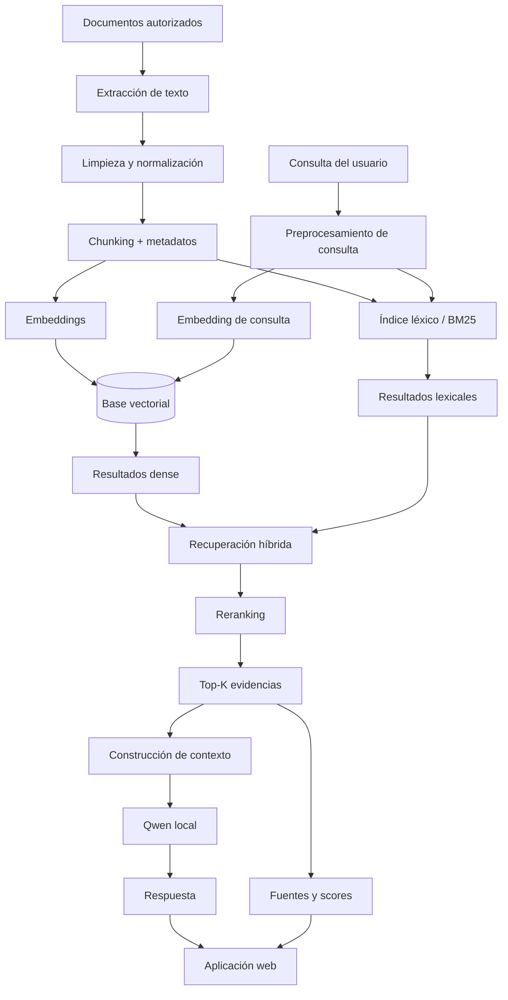

# Arquitectura del sistema

## 1. Propósito

Este documento describe la arquitectura técnica propuesta para el proyecto **Asistente de IA para Innovación, Desarrollo y Gestión del Conocimiento Técnico — DINDES**.

La solución está diseñada como un sistema **RAG (Retrieval-Augmented Generation) local/on-premise**, con el objetivo de recuperar información autorizada, proporcionar contexto a un modelo de lenguaje y generar respuestas trazables hacia las fuentes utilizadas.

---

## 2. Decisión de arquitectura

La arquitectura seleccionada es:

```text
RAG local + recuperación híbrida + reranking + LLM local + interfaz web
```

No se plantea como estrategia principal entrenar o realizar fine-tuning del modelo Qwen con la documentación institucional.

La separación entre conocimiento y modelo permite:

- actualizar documentos sin reentrenar el LLM;
- mantener trazabilidad;
- controlar qué fuentes participan en una respuesta;
- implementar filtros por metadatos;
- reducir el riesgo de memorizar información sensible;
- evaluar retrieval de manera independiente de generación.

---

## 3. Arquitectura general



---

## 4. Pipeline de datos

### 4.1 Ingesta

Entradas previstas:

- PDF;
- DOCX;
- TXT;
- CSV/XLSX estructurados cuando corresponda;
- documentación técnica autorizada.

Proceso:

```text
archivo
→ extracción
→ limpieza
→ normalización
→ segmentación
→ enriquecimiento con metadatos
```

### 4.2 Chunking

Cada fragmento deberá conservar como mínimo:

- identificador de documento;
- identificador de proyecto;
- título;
- sección;
- versión;
- fecha;
- unidad responsable;
- estado de la fuente;
- nivel de acceso;
- identificador de chunk.

Los parámetros de chunking deberán evaluarse y no fijarse únicamente por intuición.

---

## 5. Representación vectorial

### Opción principal

**Qwen3-Embedding**, sujeto a validación experimental.

### Alternativa de benchmark

**BGE-M3**.

Criterios de evaluación:

- calidad de recuperación;
- soporte multilingüe;
- costo computacional;
- memoria GPU/CPU;
- latencia;
- compatibilidad con ejecución local.

---

## 6. Almacenamiento vectorial

Candidatos:

- FAISS;
- Chroma;
- Qdrant.

La selección final deberá considerar:

- volumen del corpus;
- persistencia;
- filtros por metadatos;
- simplicidad de despliegue;
- escalabilidad;
- operación completamente local.

Para el MVP, FAISS o Chroma ofrecen una ruta simple. Qdrant puede evaluarse si se requiere una gestión más robusta de metadatos y persistencia.

---

## 7. Recuperación híbrida

El sistema combinará dos mecanismos:

### Dense retrieval

Utiliza embeddings para recuperar contenido semánticamente relacionado.

### Lexical retrieval

Utiliza coincidencia de términos mediante BM25 o técnica equivalente.

### Fusión

```text
Dense results
               → Fusión / ponderación → candidatos
       /
BM25 results
```

La recuperación híbrida busca mejorar casos donde:

- una consulta usa lenguaje semánticamente equivalente;
- existen códigos técnicos, modelos o números de parte;
- ciertos términos exactos son críticos.

Los pesos dense/BM25 serán hiperparámetros experimentales.

---

## 8. Reranking

Después de la recuperación inicial, un reranker podrá ordenar los candidatos según su relevancia respecto a la pregunta.

Opción prevista:

- Qwen3-Reranker o alternativa compatible con ejecución local.

Flujo:

```text
Top-N retrieval
      ↓
Reranker
      ↓
Top-K final
```

El reranking se evaluará comparando métricas de recuperación antes y después de su aplicación.

---

## 9. Modelo generativo

El modelo generativo será un modelo **Qwen ejecutado localmente**.

Responsabilidades:

- interpretar la pregunta;
- utilizar únicamente el contexto recuperado;
- redactar una respuesta clara;
- reconocer cuando la evidencia es insuficiente;
- evitar afirmar información no sustentada;
- incluir referencias a las fuentes utilizadas.

El modelo generativo no debe ser tratado como repositorio primario de conocimiento institucional.

---

## 10. Construcción del prompt

Estructura conceptual:

```text
INSTRUCCIONES DEL SISTEMA
- Responder usando las fuentes proporcionadas.
- No inventar información.
- Indicar cuando no existe evidencia suficiente.

CONTEXTO RECUPERADO
[Fuente 1]
[Fuente 2]
...
[Fuente K]

PREGUNTA DEL USUARIO
...

SALIDA
Respuesta + referencias
```

---

## 11. Interfaz web

La interfaz seleccionada para el MVP será **Streamlit**.

Funciones mínimas:

- ingreso de consulta;
- botón de ejecución;
- indicador de procesamiento;
- manejo de errores;
- respuesta del asistente;
- visualización de fuentes;
- score o señal de relevancia;
- ejemplos precargados;
- sección Acerca de;
- métricas y limitaciones.

Estructura:

```text
app/
├── app.py
├── requirements.txt
└── assets/
```

La aplicación podrá ejecutarse localmente mediante:

```bash
streamlit run app/app.py
```

y abrirse normalmente en:

```text
http://localhost:8501
```

---

## 12. Arquitectura de software prevista

```text
src/
├── __init__.py
├── data_processing.py
├── model.py
├── train.py
├── evaluate.py
└── utils.py
```

Responsabilidades:

### `data_processing.py`

- carga de documentos;
- limpieza;
- chunking;
- metadatos;
- preparación de datasets.

### `model.py`

- embeddings;
- almacenamiento vectorial;
- retrieval;
- reranking;
- integración con Qwen.

### `train.py`

En el contexto RAG, este módulo se utilizará para experimentos que requieran ajuste de modelos auxiliares o construcción de artefactos evaluables. No implica fine-tuning obligatorio del LLM.

### `evaluate.py`

- Precision@K;
- Recall@K;
- MRR u otras métricas de ranking;
- grounded response rate;
- latencia;
- evaluación QA.

### `utils.py`

- logging;
- lectura de configuración;
- funciones compartidas;
- utilidades generales.

---

## 13. Configuración

Los parámetros experimentales no deben quedar hardcodeados.

Se prevé utilizar un archivo:

```text
config.yaml
```

Ejemplo conceptual:

```yaml
retrieval:
  top_k_dense: 10
  top_k_bm25: 10
  top_k_final: 5
  dense_weight: 0.6
  bm25_weight: 0.4

chunking:
  chunk_size: 800
  overlap: 120

generation:
  temperature: 0.2
  max_tokens: 600
```

Los valores anteriores son ilustrativos y deberán seleccionarse mediante experimentación.

---

## 14. Hardware objetivo

Configuración local disponible:

- Intel Core Ultra 9 285K;
- 96 GB DDR5 5600;
- NVIDIA GeForce RTX 5080 16 GB;
- SSD M.2 de 1 TB;
- fuente 1000 W 80+ Gold.

Esta plataforma permite ejecutar localmente embeddings, recuperación, reranking y un LLM cuantizado compatible con la memoria disponible.

---

## 15. Tecnologías y librerías

Tecnologías previstas:

| Componente | Tecnología |
|---|---|
| Lenguaje | Python |
| Entorno | Visual Studio Code |
| Notebooks | Jupyter |
| ML auxiliar | Scikit-learn |
| LLM | Qwen local |
| Embeddings | Qwen3-Embedding / BGE-M3 |
| Vector DB | FAISS / Chroma / Qdrant |
| Lexical retrieval | BM25 |
| Reranking | Qwen3-Reranker o alternativa |
| Web UI | Streamlit |
| Versionamiento | Git + GitHub |
| Testing | pytest |

Las versiones exactas deberán mantenerse actualizadas en `requirements.txt`.

---

## 16. Seguridad y privacidad

Principios:

1. **Local-first:** procesamiento local siempre que sea posible.
2. **Datos autorizados:** no indexar información sin autorización.
3. **Repositorios separados:** el repositorio público solo contendrá samples y código.
4. **No secrets:** claves y tokens deberán mantenerse fuera de Git mediante `.env` y `.gitignore`.
5. **Control de fuentes:** las respuestas deberán indicar la evidencia utilizada.
6. **Abstención:** el sistema deberá poder responder que no existe información suficiente.
7. **Acceso:** un despliegue institucional futuro deberá incorporar autenticación y control de permisos.

---

## 17. Métricas de evaluación

### Retrieval

- Precision@K
- Recall@K
- MRR
- tasa de recuperación de fuente esperada

### Generación

- Grounded Response Rate
- exactitud respecto a respuestas esperadas
- respuestas no sustentadas
- tasa de abstención correcta

### Sistema

- latencia total;
- latencia de retrieval;
- latencia de generación;
- satisfacción del usuario;
- reducción del tiempo de búsqueda.

Metas iniciales del proyecto:

| KPI | Meta |
|---|---:|
| Precision@5 | ≥ 85 % |
| Grounded Response Rate | ≥ 90 % |
| Tiempo de respuesta | ≤ 10 s |
| Reducción de tiempo | ≥ 50 % |
| Satisfacción | ≥ 4/5 |

---

## 18. Relación con el experimento de Semana 3

El notebook de diagnóstico de overfitting/underfitting no representa el entrenamiento del RAG completo.

Se utilizó un **clasificador auxiliar de relevancia pregunta-documento** para estudiar:

- tracking de métricas;
- desbalance;
- generalización;
- data leakage;
- balanceo de clases;
- Feature Engineering;
- learning curves;
- validation curves.

La principal conclusión fue que la representación pregunta-documento resulta crítica y que Accuracy no es suficiente en presencia de fuerte desbalance.

Estos hallazgos se aplicarán al diseño del retrieval y reranking del RAG.

---

## 19. Flujo de ejecución del MVP

```text
1. Iniciar servicios/modelos locales
2. Cargar índice documental
3. Ejecutar Streamlit
4. Usuario escribe consulta
5. Validar input
6. Recuperar candidatos dense + BM25
7. Fusionar resultados
8. Aplicar reranking
9. Seleccionar Top-K
10. Construir prompt con evidencias
11. Generar respuesta con Qwen
12. Mostrar respuesta, fuentes y scores
13. Registrar métricas de la sesión
```

---

## 20. Limitaciones actuales

- Los datasets públicos del repositorio son samples sintéticos.
- El corpus todavía no representa la escala real.
- Los componentes definitivos de embeddings, vector DB y reranker requieren benchmark.
- La interfaz web se encuentra en desarrollo.
- Las metas de rendimiento todavía no constituyen resultados operacionales.

---

## 21. Próximos pasos técnicos

1. Implementar pipeline de ingesta.
2. Seleccionar embedding mediante benchmark.
3. Construir índice vectorial persistente.
4. Implementar BM25.
5. Implementar recuperación híbrida.
6. Evaluar reranking.
7. Integrar Qwen local.
8. Desarrollar Streamlit.
9. Incorporar logging y configuración.
10. Implementar tests.
11. Ejecutar evaluación end-to-end.
